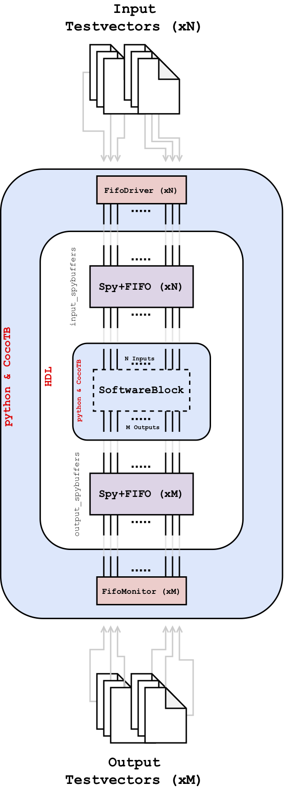
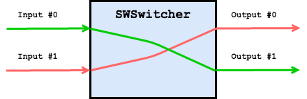

# Creating a Logic Block in Python

Creating a logic block in python is not difficult to do, especially given
that some of the work is already done for you if you leverage the
[`SoftwareBlock`](../src/tp_tb/utils/software_block.py)
base class provided by the testbench infrastructure.

For the following, we will assume that you wish to design a logic block in python
and have no logic defined in HDL *at all*. That is, the figures appearing
in the [testbench overview section](../README.md#overview-of-the-testbench-infrastructure)
are changed to look something like the following figure,
<div align="center">
    
</div>

where the HDL logic block interfacing to `input_spybuffers` and `output_spybuffers`
is replaced by a software-defined logic block (`"SoftwareBlock"`) written using the `python` programming
language and `cocotb` constructs.

In the following we will present a tutorial showing how to implement such a scenario.
Follow the items in the following Table of Contents sequentially.

<!----------------------------------------------------------------------------->
<!----------------------------------------------------------------------------->
<!--------------------------- TABLE OF CONTENTS ------------------------------->
<!----------------------------------------------------------------------------->
<!----------------------------------------------------------------------------->

Table of Contents
==================
   * [Requirements](#requirements)
   * [Environment Preparation](#prepare-your-environment)
   * [Define the Purpose of the Software Logic Block](#purpose-of-the-software-block)
   * [Run `tb create` to Initialize the Testbench](#run-tb-create)
 
   
<!----------------------------------------------------------------------------->
<!----------------------------------------------------------------------------->
<!----------------------------- REQUIREMENTS ---------------------------------->
<!----------------------------------------------------------------------------->
<!----------------------------------------------------------------------------->

# Requirements

You must satisfy the [requirements](../README.md#requirements) and
[installation](../README.md#installation-and-setup) of the testbench
infrastructure.

<!----------------------------------------------------------------------------->
<!----------------------------------------------------------------------------->
<!----------------------- PREPARE YOUR ENVIRONMENT ---------------------------->
<!----------------------------------------------------------------------------->
<!----------------------------------------------------------------------------->
Move to the `tp-fw/tb` directory and setup the testbench environment:

```bash
$ cd /your/specific/path/tp-fw/tb
$ source setup_env.sh
Virtual environment "env" has been activated. Type 'deactivate' to exit.
(env) $ tb -h # <-- run this to ensure that the "tb" command is working properly
Usage: tb [OPTIONS] COMMAND [ARGS]...

  Top-level entrypoint into TP fw cocotb test-bench infrastructure.

Options:
  -h, --help  Show this message and exit.

Commands:
  check-config     Check/inspect a testbench's configuration (*.json) file.
  create           Create a new test.
  diff             Diff two *.evt files and test for differences.
  dump             Dump the contents of an *.evt file.
  list             List all available testbenches and their status.
  run              Setup and run cocotb-based testbenches.
  test-summary     Dump the test results *.json file.
  update-makefile  Update the QuestaSim makefile used by CocoTB to dump all...
```
<!----------------------------------------------------------------------------->
<!----------------------------------------------------------------------------->
<!---------------------------------- PURPOSE ---------------------------------->
<!----------------------------------------------------------------------------->
<!----------------------------------------------------------------------------->
# Purpose of the Software Block

Before implementing the logic block, you must first have a clear idea of what
it is supposed to do.

For the sake of this tutorial, let's assume that we want a block that swaps
the order of it's inputs. That is, the "first" input gets mapped to the "last" output.
So if we have two inputs and two outputs, the dataflow would look like:

<div align="center">
    
</div>
   

<!----------------------------------------------------------------------------->
<!----------------------------------------------------------------------------->
<!---------------------------- RUN TB CREATE ---------------------------------->
<!----------------------------------------------------------------------------->
<!----------------------------------------------------------------------------->


